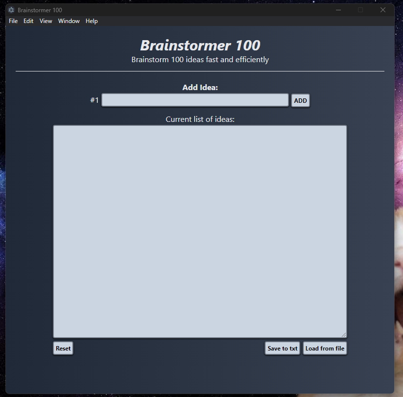
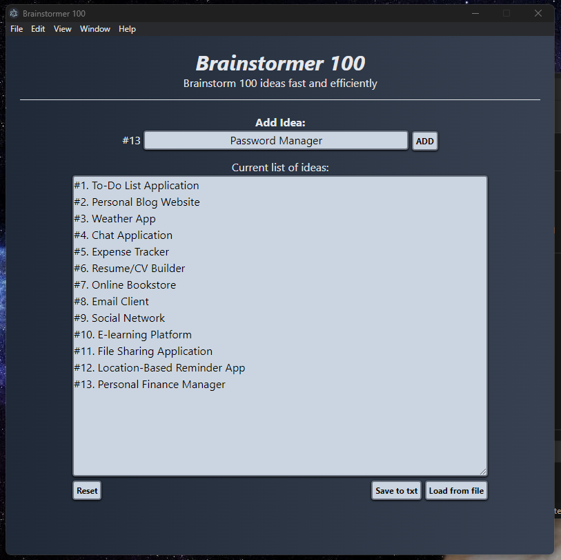

## Brainstormer Desktop app

Desktop application to brainstorm 100 ideas, needed this kind of app so i made it quickly. It's very simple mini project what took less than 1 day to make and the same time to got familiar with electron.
Made by using electron, node.js, tailwindCSS, js, html.

